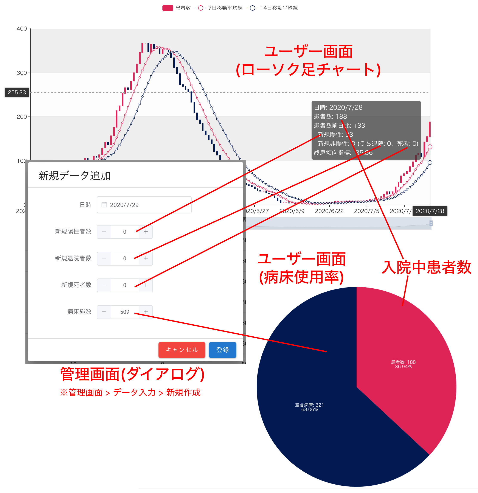
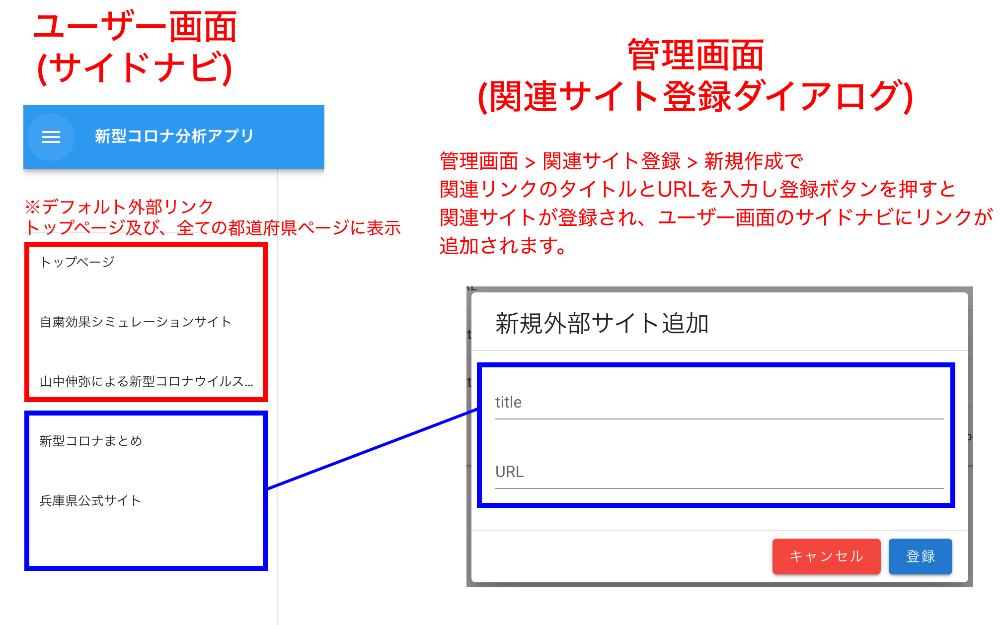
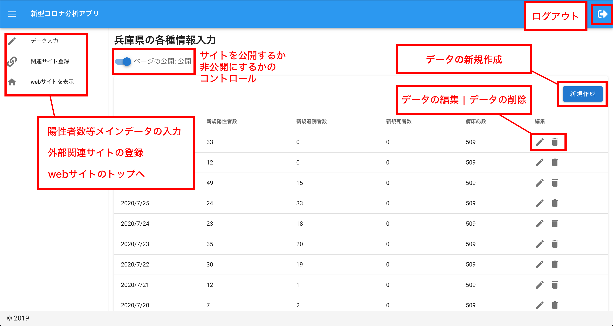
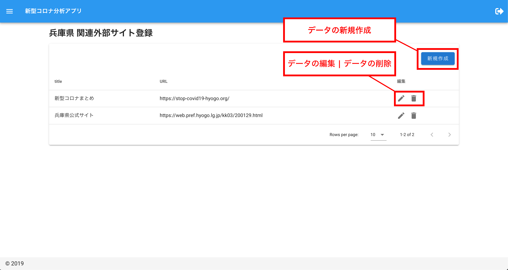

# フロントエンド

## 採用技術、使用ライブラリ等
- [Nuxt.js](https://ja.nuxtjs.org/)
- [echarts](https://echarts.apache.org/en/index.html)
- [crypto-js](https://github.com/brix/crypto-js)

## 管理画面とユーザー画面の関連図
#### 数値入力画面とチャートの関連図

#### 関連サイト登録とサイドナビの関連図

## 管理画面のUI概要図

 

## 認証周りの工夫
認証に関しては、[Nuxt.js | 外部認証API (JWT)](https://ja.nuxtjs.org/examples/auth-external-jwt)を参考にCookieにトークンを保持  
Cookie内のトークンは漏洩しても問題が無いようCookieに保存する前に  
crypto-jsで二重暗号化したトークンを保持するように実装しています。  
認可が必要なAPIをリクエストする際は直前に正規のトークンに復号し  
リクエストを送信する仕様としています。
